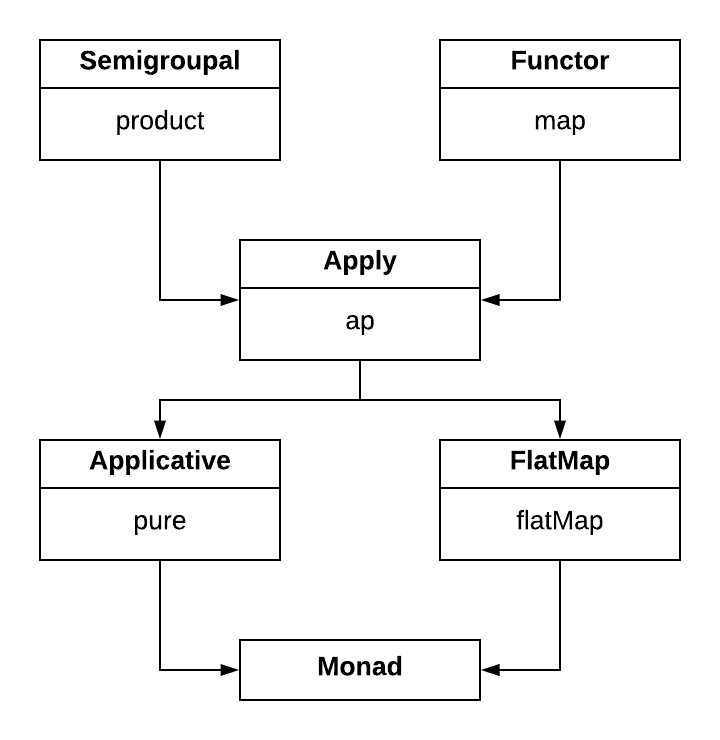

<h4 align="right">
    <a href="lesson5_2_validated.md">← Previous</a> |
    <a href="../README.md">Menu</a> |
    <a href="lesson5_4_foldable.md">Next →</a>
</h4>

<h1>Apply & Applicative</h1>

<h3>Apply</h3>

Cats models `Applicative`s using 2 type classes. The first, `Apply` extends `Semigroupal` and `Functor` and adds an `ap`
method that applies a parameter to a function within a context:

```scala
import cats{Functor, Monad, Semigroupal}
import scala.language.higherKinds

trait Apply[F[_]] extends Semigroupal[F] with Functor[F] {

  // applies parameter fa to function ff within context F[_]
  def ap[A, B](ff: F[A => B])(fa: F[A]): F[B]

  // defined in terms of `ap` and `map`
  def product[A, B](fa: F[A], fb: F[B]): F[(A, B)] = {
    ap[B, (A, B)](map(fa)(a => (b: B) => (a, b)))(fb)
  }
}
```

<h3>Applicative</h3>

The second, `Applicative`, extends `Apply` and adds the `pure` method introduced with `Monad`s in lesson 4. In this
sense, `Applicative` is to `Apply` what `Monoid` is to `Semigroup`:

```scala
import cats.Apply
import scala.language.higherKinds

trait Applicative[F[_]] extends Apply[F] {
  def pure[A](a: A): F[A]
}
```

<h3>Functional hierarchy</h3>

The main point here is that there is a tight relationship between `product`, `ap`, and `map` that allows any one of them
to be defined in terms of the other 2. This extends further to the hierarchy of `Applicative`s and `Monad`s:



In this sense you could say that:

  - every `Monad` is an `Applicative`
  - every `Applicative` is a `Semigroupal`
  - etc...

Let's say we have 2 hypothetical data types:

In the first type, `Foo` implements `pure` and `flatMap` and inherits standard definitions of `product`, `map`, and
`ap`:

```scala
trait Foo[F[_]] extends Monad[F] {
  def pure[A](value: A): F[A]
  
  def flatMap[A, B](value: F[A])(f: A => F[B]): F[B]
}
```

In the second type, `Bar` implements `pure` and `ap` and inherits standard definitions of `product` and `map`:

```scala
trait Bar[F[_]] extends Applicative[F] {
  def pure[A](value: A): F[A]
  
  def ap[A, B](ff: F[A => B])(fa: F[A]): F[B]
}
```

What can we say about these 2 data types without knowing more about their implementation?

We know strictly more about `Foo` than `Bar`. Since `Monad` is a subtype of `Applicative`, we can guarantee properties
of `Foo` (namely `flatMap`) that we can't guarantee with `Bar`.

We also know that `Bar` has fewer laws to obey so it can implement behaviors that `Foo` can't. 

The more constraints we place on a data type, the more guarantees we have about its behavior, but the fewer behaviors we
can model. While `Monad`s impose a strict sequencing on the computations they model, `Applicative`s and `Semigroupal`s
have no such restriction and we can use them to represent classes of parallel or independent computations that `Monad`s
cannot.

<h4 align="right">
    <a href="lesson5_2_validated.md">← Previous</a> |
    <a href="../README.md">Menu</a> |
    <a href="lesson5_4_foldable.md">Next →</a>
</h4>
